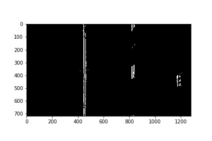
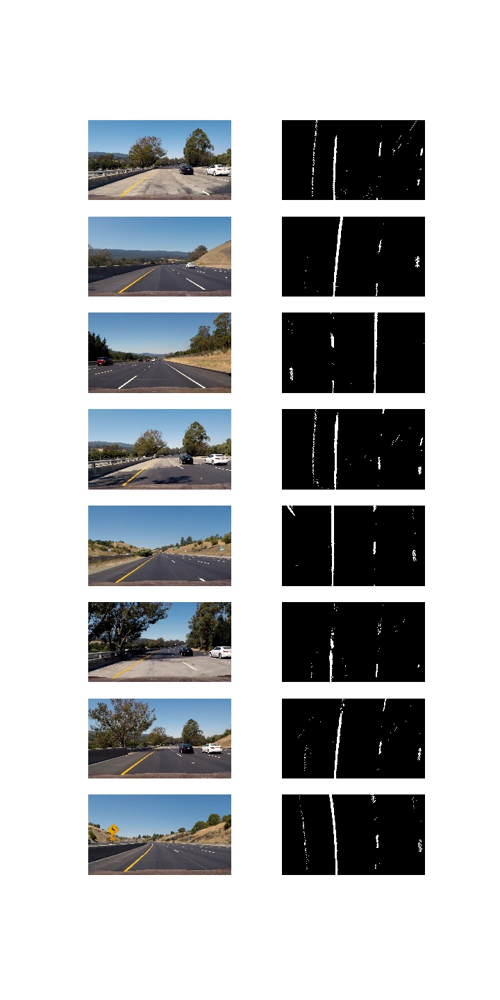

# Advanced Lane Detection
## Overview
This is Project 2 in Udacity's Self Driving Car Nanodegree.The code from the lecture notes has been used as reference. 

The following steps were performed for lane detection:

* Compute the camera calibration matrix and distortion coefficients given a set of chessboard images.
* Apply a distortion correction to raw images.
* Use color transforms, gradients, etc., to create a thresholded binary image.
* Apply a perspective transform to rectify binary image ("birds-eye view").
* Detect lane pixels and fit to find the lane boundary.
* Determine the curvature of the lane and vehicle position with respect to center.
* Warp the detected lane boundaries back onto the original image.
* Output visual display of the lane boundaries and numerical estimation of lane curvature and vehicle position.

The ouput video is 'project_video_output.mp4' in this repo. The original video is 'project_video.mp4'.

## Dependencies
* Python 3
* Numpy
* OpenCV-Python
* Matplotlib
* Pickle

## Camera calibration
The camera was calibrated using the chessboard images that were given in 'camera_cal/*.jpg'. The following steps were performed for each calibration image:

* First the image was converted to grayscale using 'cv2.cvtColor()'
* Assuming 9x6 chessboard, chessboard corners were found with OpenCV's 'findChessboardCorners()' function

After the above steps were executed for all calibration images,OpenCV's 'calibrateCamera()' function was used to calculate the distortion matrices and saved as 'cameracalibration.p' to be used to undistort images. Using the distortion matrices, images have been undistorted using OpenCV's 'undistort()' function.

## Pipeline
The following describes and illustrates the steps involved in the lane detection pipeline.

### Undistort image
Using the camera calibration matrices in 'calibratecamera.p' and 'undistortImage()', I undistorted the input image. Output undistorted image is as follows:

### Perspective transform
Given the undsitored binary image, the next step is to perform a perspective transform, i.e. to get bird's eye view of the lanes so that the curves in the lanes can be detected easily. In addition to it, the area of the image is cropped such that the area in which lane line pixels are most likely remains. 

To accomplish the perspective transform, OpenCV's 'getPerspectiveTransform()' and 'warpPerspective()' functions. I hard-coded the source and destination points for the perspective transform. The source and destination points were visually determined by manual inspection but I think that an important enhancement would be to algorithmically determine these points.

Output after applying perspective transform is as follows:

### Absolute Horizontal Sobel Operator
After applying perspective transform, Horizontal Sobel Operator is applied to find the pixels that are most likely be part of lanes. Image is converted to Grayscale and then function 'cv2.Sobel' is used.

Output after applying Absolutie Sobel Operator in x direction:

### Magnitude Sobel Operator
After applying perspective transform, Sobel Operator is applied in x direction and y direction. Then, both outputs were used to find magnitude. 

Output after applying Magnitude Sobel Operator:

### Direction Sobel Operator
After applying perspective transform, Sobel Operator is applied in x direction and y direction. Then, both outputs were used to find direction. 

Output after applying Directional Sobel Operator:

### Combined Magnitude and Direction Sobel Operators
After applying perspective transform, magnitude and direction sobel operators, their outputs are combined to make the best use of outputs by both functions.

Output after applying combining outputs from Magnitude and Direction Sobel Operators:

### HLS Colorspace
After applying perspective transform, hls colorspace is used to find yellow lines in the image.

Output after thresholds on HLS Colorspace:

### Thresholded binary image
The next step is to find the best match of outputs provided by functions defined above to find the pixels that are part of the lane. After trying different combinations, the best match that I found was combination of hls colorspace, lab colorspace and sobelcombined outputs. 

Output after applying this step is as follows:

### Polynomial fit
Now, a 2nd order polynomical fit is applied to find left and right lane lines. The following steps are performed to achieve this:

* First, I calculate a histogram of the bottom half of the image
* By sliding the window, I found the pixels that are most likely to be a part of left and right lanes. 
* I fitted a polynomial on pixels corresponding to left and right lanes. 

The code to perform the above is in the 'find_lane_pixels' function.

Then, 'polyfit_using_prev_fit()' is used to combine old fit with the new fit and draw left and right lanes on the image.

Output is in the image below:

### Radius of curvature and Vehicle offset from lane center
After fitting the polynomial on left and right lanes, I calculate the radius of curvature for ach lane and converted from pixels to metres. The radius of curvature for the left and right lane lines was averaged to find radius of curvature. 

I calculated the offset by subtracting the vehicle's center x value (i.e. center x value of the image) and the lane's center x value.

The code to calculate the radius of curvature is in the function 'calc_curv_rad_and_center_dist()'

### Adding radius of curvature and offset to the image. 
After calculating radius of curvature, offset and lane area, all these paraemeeters can be added to the image. 

* I created a blank image, drew the left and right lines, filled the area between lanes with green color and unwarped the image so that it is matched with original image's perspective. 
* I added radius of curvature and offset data to the image.

The code to perform the above is in the function 'draw_lane()'

Output is as follows:

## Discussion
For the Udacity harder challenge video, the code fails to detect lanes properly. More work can be done to make the lane detector more robust. For example, deep learning can be incorporated with computer vision to detect lanes.
